InfraWatch — IT Asset Monitoring System
InfraWatch is a full-stack IT asset monitoring system designed to track, manage, and monitor organizational assets in real time. It provides visibility into system health, asset status, and operational insights through a centralized dashboard.

Overview
InfraWatch helps organizations:
* Track IT assets (systems, servers, devices)
* Monitor system health and status
* Manage asset lifecycle efficiently
* Receive real-time updates from agents
* Improve operational transparency

Architecture
The system consists of three main components:
* **Frontend** => User interface for monitoring and management
* **Backend** => API layer handling business logic and data
* **Agent** => Installed on systems to collect real-time data

Screenshots
Dashboard Overview
### Login page
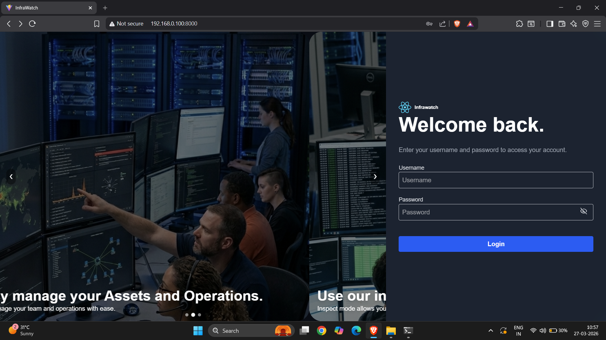

### Asset Management home page
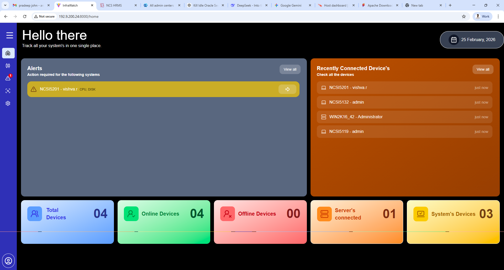

### Agent Monitoring dashboard panel
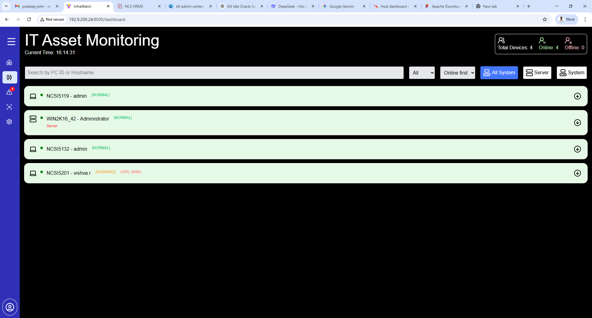
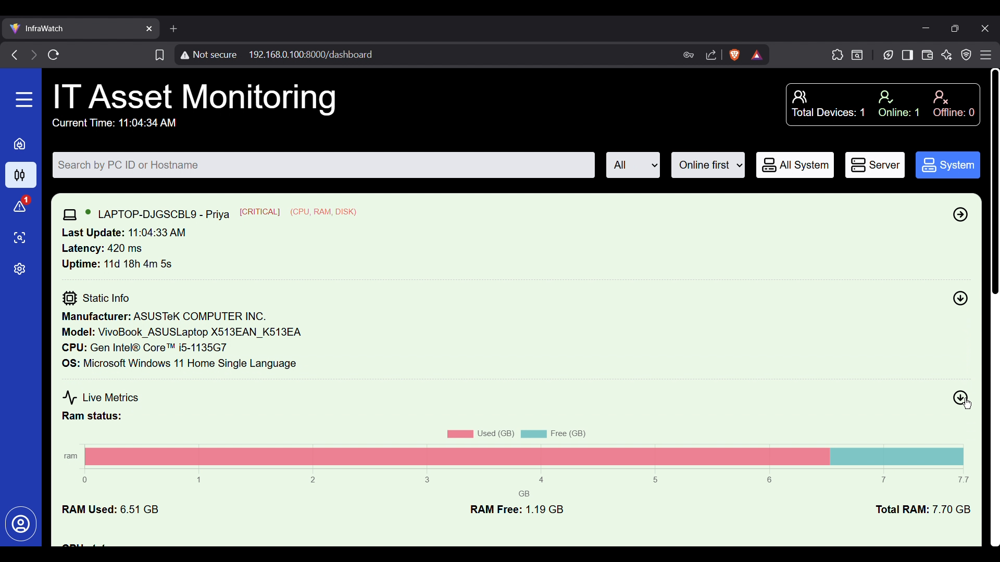
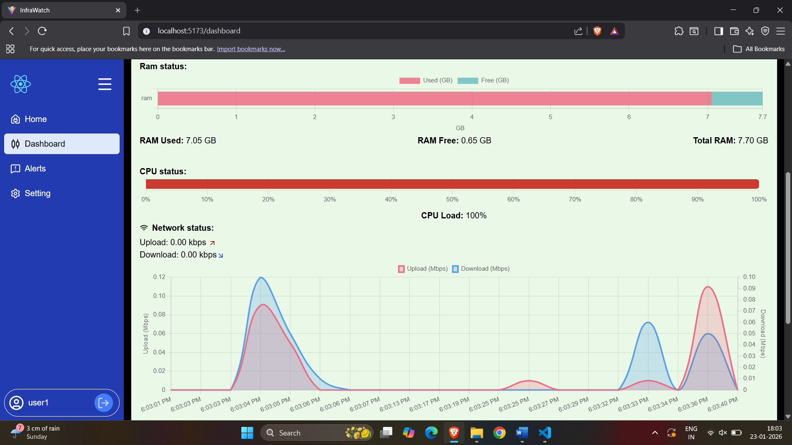
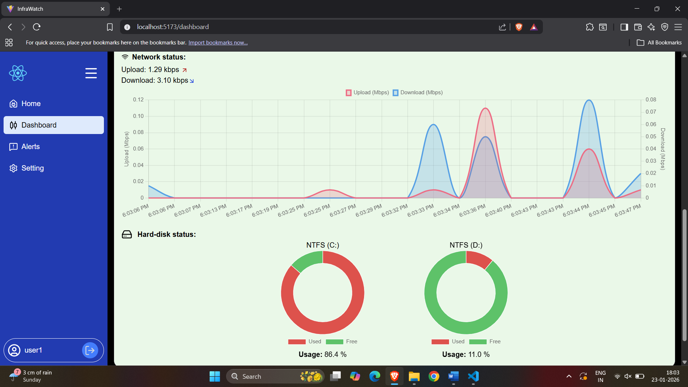
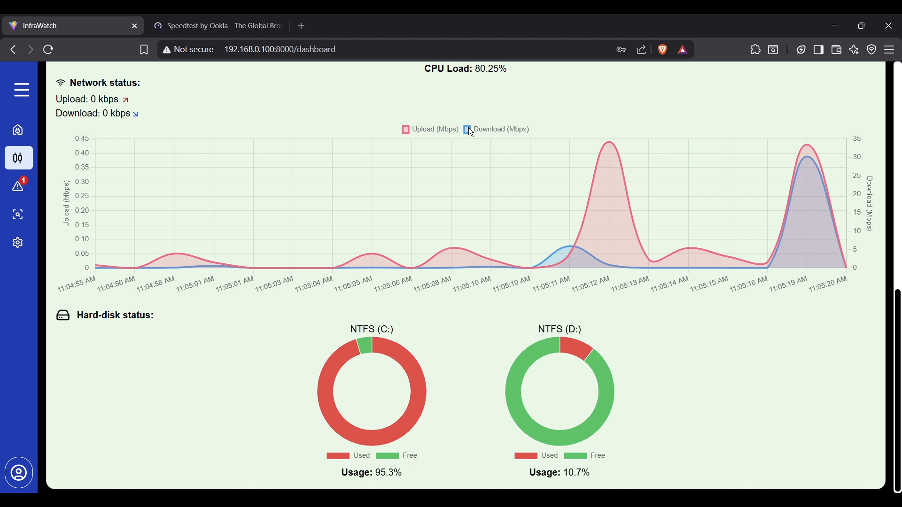

### Alert dashboard
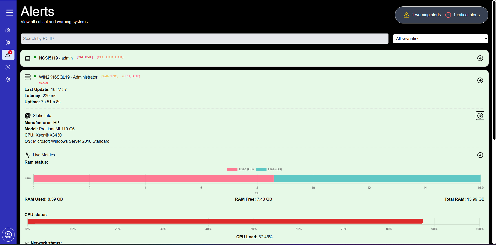

### inspect section
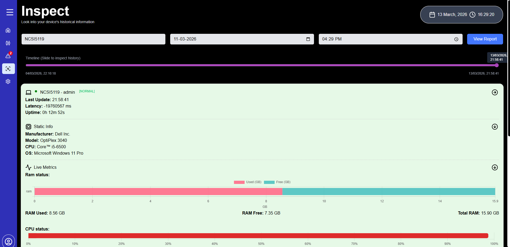

### Setting and user management
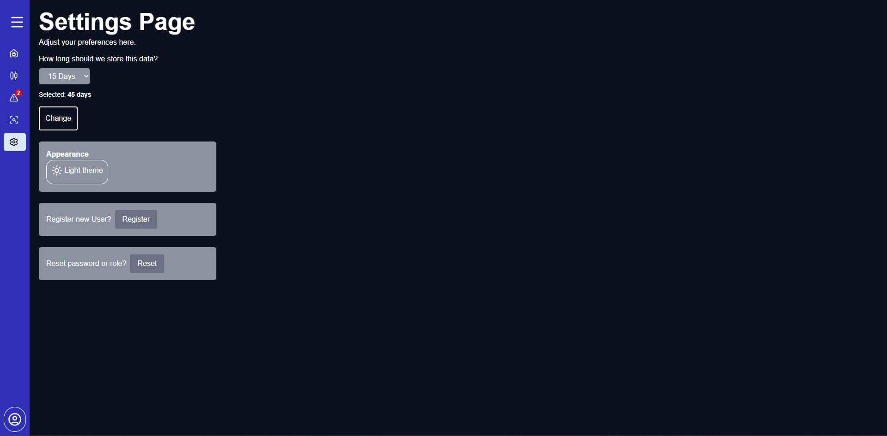
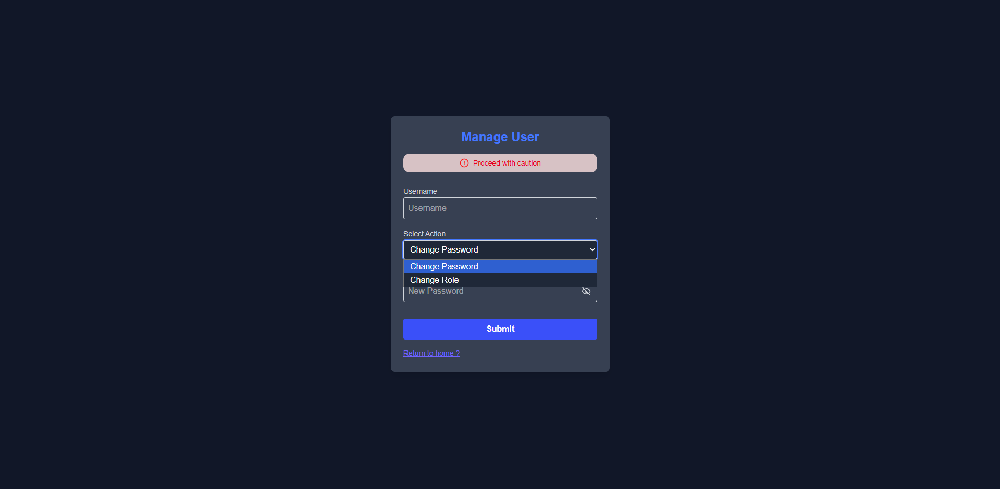
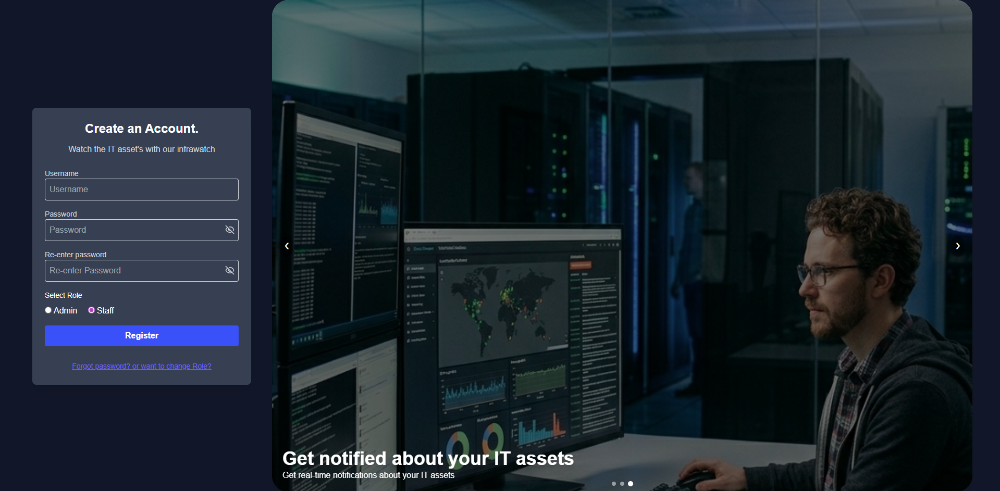

### Backend API Testing (Postman)
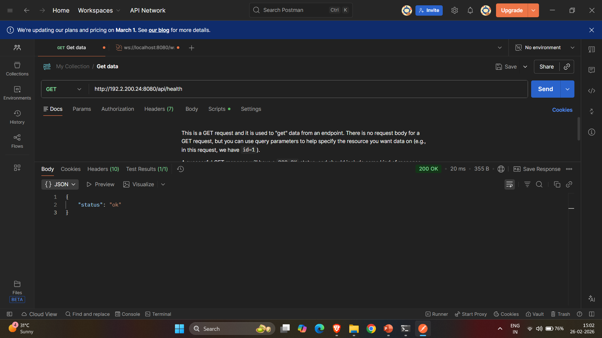
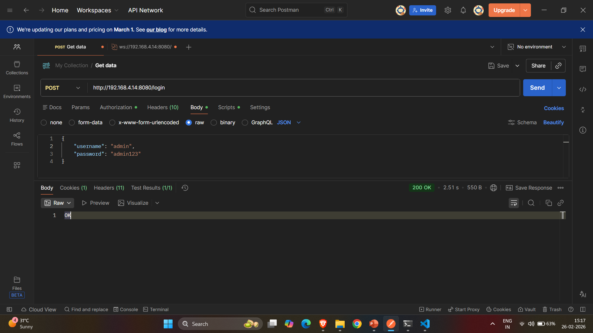
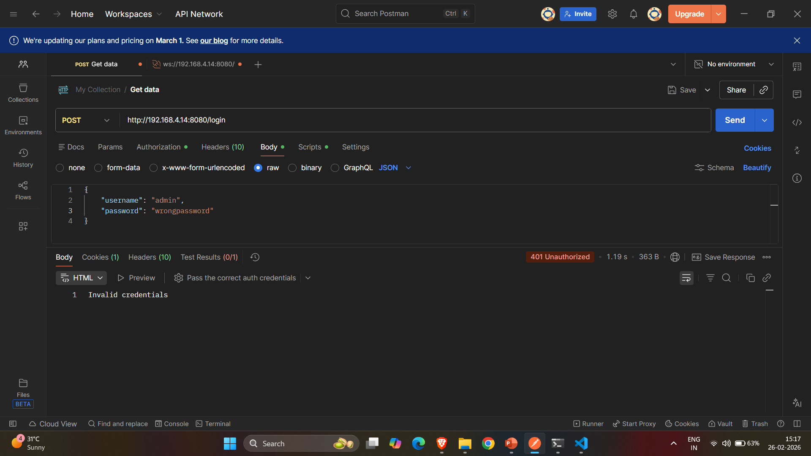
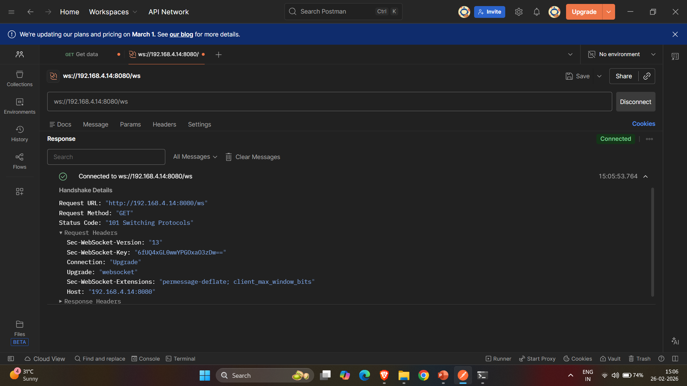

Tech Stack
Frontend
* React.js
* Chart.js
* Axios
* Tailwind CSS / CSS

Backend
* Node.js
* Express.js
* REST API Architecture
* Socket.io

Database
* MSSQL

Agent
* Node.js-based agent
* Collects system data (CPU, memory, etc.)


Project Structure
```
infra-watch/
│
├── frontend/
│   ├── components/
│   ├── pages/
│   └── services/
│
├── backend/
│   ├── routes/
│   ├── controllers/
│   ├── services/
│   └── config/
│
├── agent/
│   └── system-monitor.js
│
└── database/
    └── schema.sql
```

Features

* Real-time asset monitoring
* RESTful API integration
* Scalable backend architecture
* Modular code structure
* Agent-based data collection
* Database-driven asset management

How to Run
1) Clone the Repository

```
git clone https://github.com/pradeepjohndev/infrawatch.git
cd infrawatch
```

2) Setup Backend

```
cd backend
npm install
npm start
```

3) Setup Frontend

```
cd frontend
npm install
npm start
```

4) Setup Database (mssql)

* Create database
* Run schema.sql file

5) Run Agent

```
cd agent
node system-monitor.js
```

Future Enhancements
* Alert/notification system
* Advanced analytics dashboard
* Cloud deployment (AWS/Azure)

Author
Pradeep John
pradeepjohn028@gmail.com(mailto:pradeepjohn028@gmail.com)

Acknowledgment
This project was built as part of a real-world learning experience to understand full-stack development, system design, and monitoring tools.

